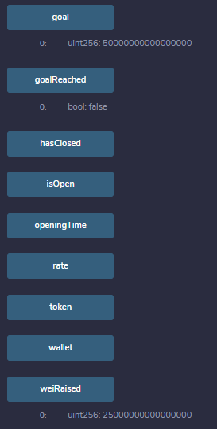

# Unit 21: Advanced Solidity Homework

 

## Background

 

Your company has decided to crowdsale their PupperCoin token in order to help fund the network development. This network will be used to track the dog breeding activity across the globe in a decentralized way, and allow humans to track the genetic trail of their pets. You have already worked with the necessary legal bodies and have the green light on creating a crowdsale open to the public. However, you are required to enable refunds if the crowdsale is successful and the goal is met, and you are only allowed to raise a maximum of 300 Ether. The crowdsale will run for 24 weeks.

  

- - - 

 

## Notes

 

* Crowdsale rate calculator 
https://docs.openzeppelin.com/contracts/2.x/crowdsales#crowdsale-rate

* A token (TKN) can be divided into TKNbits just like Ether can be divided into wei
* When using a rate of 1, just like 1000000000000000000 wei is equal to 1 Ether, 1000000000000000000 TKNbits is equal to 1 TKN

  

- - - 

 

## Files

 

*  [PupperCoin.sol](sol/PupperCoin.sol)
*  [Crowdsale.sol](sol/Crowdsale.sol)

  

- - - 

 

## Deploy and test locally using Ganache

 

1) Run Ganache and pre-fund 5x wallets with 5000 ETH

 

2) Compile Crowdsale.sol using compiler version 0.5.5

 

3) Deploy Crowdsale.sol to Ganache using the following config:

    * Name: PupperCoin
    * Symbol: PUP
    * Goal: 300 ETH
    * Rate: 1
    * Duration: 24 weeks
    * Open: now
    * Close: now + 24 weeks
    * Deployment address (deployed from): 0x033c2F573334b7207004aD49Da811908d6a8fbFf
    * Crowdsale payable address: 0xEA7d25D5cCF05b9203C0cEF4446d16495c9c5dfc

        

 

4) Record deployment details

    * Deployer contract address: 0x90082aA4c0246430996f1572d56016e0538E6a93
    * Token address: 0x756616B829928015fdffe44d545bCA1B51E2485e
    * Token sale address: 0xD978f52FdB0F73CB364859dF78A403EbC02b9dFa

 

5) Find PupperCoinSale contract using token sale address above (use 'At Address' feature of remix to find contract)

 

6) Test coin purchases

    * Purchase 100 ETH from address: 0x45aB2a3B46997558425b86aBD5048a80026a7606

    * NOTE: getting VM errors using Ganache but works on Ropsten, completing activity there.

  

- - - 

  

## Deploy and test on Ropsten

 

1) Compile Crowdsale.sol using compiler version 0.5.5

 

2) Deploy Crowdsale.sol to Ropsten using the following config:

    * Name: PupperCoin
    * Symbol: PUP
    * Goal: .05 ETH
    * Rate: 1
    * Duration: 24 weeks
    * Open: now
    * Close: now + 24 weeks
    * Deployment address (deployed from): 0x820dc49107318c7029cA30Fb213E0e5b0f51AF3e
    * Crowdsale payable address: 0x18Cf7fe75557811E2a575b9BB68594B85a994a3E

        

 

4) Record deployment details

    * Deployer contract address: 0xAc963fF3dF5E37084F6930a39352ABE798BDa38d
    * Token address: 0x889FA85E7a08fF7813Fa7dA9bA264Fc6efc5E64F
    * Token sale address: 0x5071EB0CC971bc309b8E0FF1c83F0b02AC6e61Cf

 

5) Find PupperCoinSale contract using token sale address above (use 'At Address' feature of remix to find contract)

 

6) Test coin purchases

    * Purchase .025 ETH from address: 0x7E395CE8edf27016cc3b5b4EA6F4f171C8243420
        * https://ropsten.etherscan.io/tx/0xc2579f8eadd28839b1d133efe815b1e31d93ae17fd6311479a5141c225a4dfb7

        

    * Check fundraising goal:

        

    * Purchase another .025 ETH from address: 0x7E395CE8edf27016cc3b5b4EA6F4f171C8243420
        * https://ropsten.etherscan.io/tx/0x21e0a59418b8518e58d34a766418eaebf507ec27d0505495357f31cdb5ff1e03

    * Check fundraising goal - reached!:

        

7) Finalize contract

